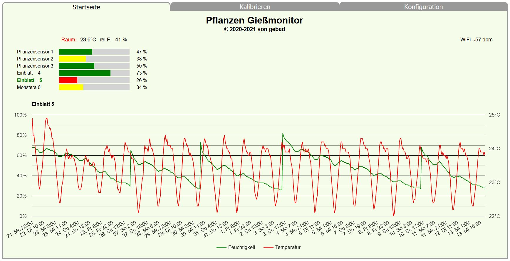

# Pflanzen Gießmonitor
####Messung der Erdfeuchte mit max. 6 Sensoren und deren grafische Darstellung
 
- <a href=merkmale.md>Merkmale</a>
- <a href=aufbau.md>Aufbau des Gießmonitors</a>
- <a href=install.md>Installation der Software</a>
- <a href=besonderheiten.md>Besonderheiten des Programms</a>
- <a href=kalibrierung.md>Kalibrierung der Sensoren</a>

Den Pflanzenwächter von Tobias Kuch (https://github.com/KuchTo/Plant_Moisture_Sensor) habe ich nach meinen Vorstellungen modifiziert und erweitert.

