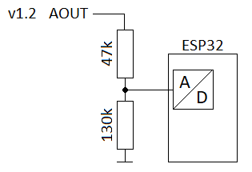

####Aufbau des Gießmonitors

#####Benötigt wird:

-	Esp32-Modul z.B. Dev Kit C mit herausgeführten Anschlüssen für ADC1 CH0, CH3, CH4, CH5, CH6 und CH7
-	1x Temperatur-, Luftfeuchtesensor BME280 (bevorzugt) oder DHT22
-	1x KY-016 3-Farben RGB LED Modul (Hintergrund: Erforderliche Vorwiderstände für LED sind bereits auf LP)
-	6x kapazitiver Feuchtigkeitssensor Modul v1.2
-	6x Widerstand 130k
-	6x Widerstand 47k

Beschaltung der Modul Ein-/Ausgänge. Wie V5/VCC und GND anzuschließen sind, setze ich voraus.

#####Ausgang Modul nach Pin esp32

BME280 SCL  -> GPIO22 (je nach verwendeten Temperatur-, Luftfeuchtesensor)
BME280 SDA -> GPIO21 (je nach verwendeten Temperatur-, Luftfeuchtesensor)
DHT22 out    -> GPIO4 (je nach verwendeten Temperatur-, Luftfeuchtesensor)
KY-016 R -> GPIO0
KY-016 G -> GPIO15
KY-016 B -> GPIO14
Feuchtigkeitssensor Modul v1.2 AOUT -> Spannungsteiler nach Skizze

 
Vom Spannungsteiler zum ADC esp32
Sensor 1 -> ADC1 CH0 (SP)
Sensor 2 -> ADC1 CH3 (SN)
Sensor 3 -> ADC1 CH4 (GPIO32)
Sensor 4 -> ADC1 CH5 (GPIO33)
Sensor 5 -> ADC1 CH6 (GPIO34)
Sensor 6 -> ADC1 CH7 (GPIO35)