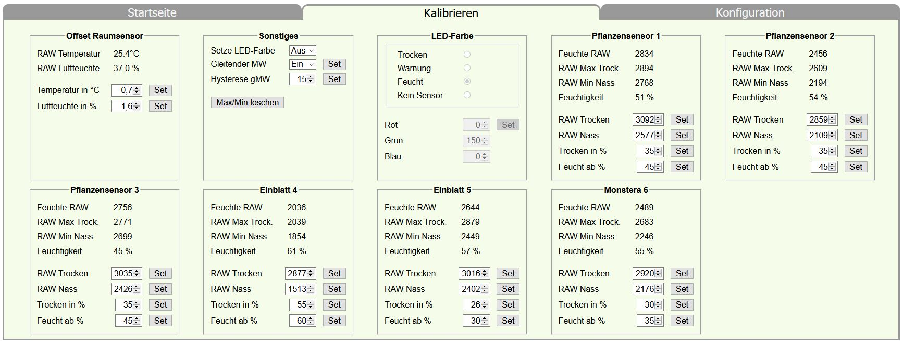

####Kalibrierung der Sensoren
#####Kapazitive Feuchtigkeitssensor-Module
Auf der Webseite "Kalibrieren" werden die RAW-Messwerte der Sensoren angezeigt. Bei Bedarf sind diese mit „Max/Min löschen“ zurückzusetzen. Im trockenen Zustand wartete ich bis sich der Wert von „RAW Max Trocken“ nicht mehr änderte. Dieser Wert +5 Einheiten ist bei „RAW Trocken“ einzugeben und zu bestätigen.
Für die Ermittlung von Sensor nass ist der Messfühler in ein mit Wasser gefülltes Glas einzutauchen. Achtung, maximale Eintauchtiefe des Messfühlers beachten!
Nach Stabilisierung des Wertes „RAW Min Nass“ ist dieser –5 Einheiten bei „RAW Nass“ einzutragen und zu bestätigen.
Jetzt sieht man auch einen korrekten Wert „Feuchtigkeit“ und auf der Startseite des Sensors wird nun keine Fehlermeldung angezeigt.
#####Temperatur-, Luftfeuchtesensor BME280
Für den Temperaturvergleich verwendete ich ein Infrarot Fieberthermometer mit Raumtemperaturmessung.
Für die Kalibrierung des Feuchtigkeitssensors deckte ich die Luftschlitze meines Gehäuses mit einen sehr feuchten, nicht tropfnassen, Tuch ab (Achtung, Modul nicht direkt mit Nässe in Verbindung bringen!). Erwärmte dieses etwas und lies den Sensor wieder abkühlen. Auf diese Weise zeigte mir der Sensor einen maximalen Messwert von 98,4% an. Somit stellte ich den Feuchtigkeitsoffset auf +1,6% ein.

